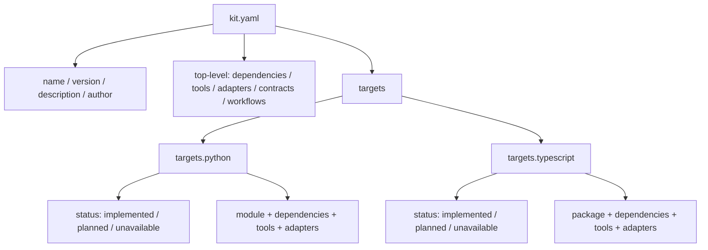
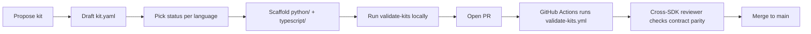
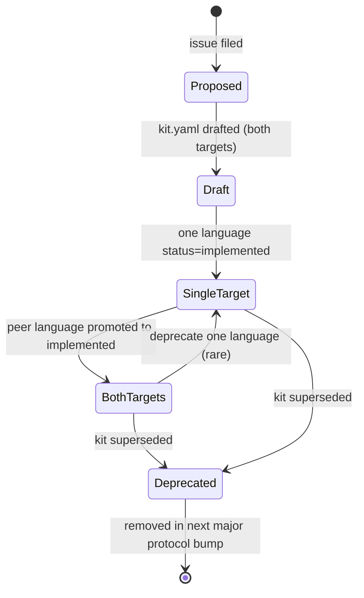

# Contributing to Beddel

This repository (`botanarede/beddel`) is the **central kit and spec catalog**
for the Beddel agent workflow ecosystem. It is consumed by two SDKs:

- [`beddel-py`](https://github.com/botanarede/beddel-py) — Python SDK
- [`beddel-ts`](https://github.com/botanarede/beddel-ts) — TypeScript SDK

This guide is for contributors adding kits, evolving the spec, or proposing
protocol changes.

---

## Repo Purpose

This repo holds the **portable contract** between Beddel SDKs: shared schemas,
port interfaces, fixtures, and the kit catalog. It does **not** contain SDK
runtime code. Each kit declares both `targets.python` and `targets.typescript`
blocks so a single source of truth describes what is implemented, planned, or
unavailable in each language.

---

## Directory Layout

```mermaid
flowchart LR
  ROOT[botanarede/beddel] --> KITS[kits/]
  ROOT --> SPEC[spec/]
  ROOT --> GH[.github/workflows/]
  ROOT --> DOCS[README.md / CONTRIBUTING.md]

  KITS --> K1[<kit-name>/]
  K1 --> KY[kit.yaml]
  K1 --> PY[python/]
  K1 --> TS[typescript/]
  K1 --> README[README.md]

  PY --> PYSRC[src/<module>/]
  PY --> PYTESTS[tests/]
  TS --> TSSRC[src/]
  TS --> TSTESTS[tests/]
  TS --> TSPKG[package.json]

  SPEC --> SCHEMAS[schemas/workflow.schema.json]
  SPEC --> CONTRACTS[contracts/I*.json]
  SPEC --> KITSCHEMA[kits/kit-manifest.schema.json]
  SPEC --> FIX[fixtures/]
  SPEC --> PROTO[PROTOCOL.md]

  GH --> WF[validate-kits.yml]
```

| Path                              | Purpose                                                                           |
| --------------------------------- | --------------------------------------------------------------------------------- |
| `kits/<name>/kit.yaml`            | Manifest — required for every kit. Validated by CI.                               |
| `kits/<name>/python/`             | Python implementation (or placeholder README when status is planned/unavailable). |
| `kits/<name>/typescript/`         | TypeScript implementation (or placeholder README when status is planned/unavailable). |
| `kits/<name>/README.md`           | Optional kit-level overview. The per-language READMEs live inside `python/` and `typescript/`. |
| `spec/schemas/workflow.schema.json` | Workflow YAML schema consumed by both SDK parsers.                              |
| `spec/contracts/I*.json`          | Port interface specifications (one JSON per port).                                |
| `spec/kits/kit-manifest.schema.json` | Authoritative kit manifest schema.                                             |
| `spec/fixtures/`                  | Cross-SDK parity fixtures (valid/invalid workflows, expected outputs).            |
| `spec/PROTOCOL.md`                | Protocol versioning and compatibility statement.                                  |
| `.github/workflows/validate-kits.yml` | CI gate — schema and parity validation on every PR.                           |

---

## Kit Anatomy

Every kit `kit.yaml` is structured the same way:

**Top-level fields** (`tools`, `adapters`, `contracts`, `workflows`) describe
the kit's contract surface in language-agnostic terms. **`targets.<lang>`**
describes how each language implements that surface.

The four **language-target metadata fields** introduced in protocol version
`2026-05-09`:

- `status` — `implemented`, `planned`, or `unavailable`.
- `implementation_path` — repo-relative path; recommended when `status: planned`.
- `unavailable_reason` — required prose when `status: unavailable`. Should name
  the peer kit.
- `dev_note` — free-form contributor note.

See [`spec/PROTOCOL.md`](./spec/PROTOCOL.md) for full semantics.

---

## Cross-Language Parity Rules

Every kit falls into exactly one of three groups:

| Group | Pattern                              | Example kits                                                                    |
| ----- | ------------------------------------ | ------------------------------------------------------------------------------- |
| **A** | Both languages `implemented`         | `observability-otel-kit`, `protocol-mcp-kit`, `agent-claude-kit`                |
| **B** | Python `implemented`, TS `planned` or `unavailable` | `tools-http-kit` (planned), `serve-fastapi-kit` (unavailable, peer = `serve-express-kit`) |
| **C** | TS `implemented`, Python `planned` or `unavailable` | `memory-backboard-kit` (planned), `serve-express-kit` (unavailable, peer = `serve-fastapi-kit`) |

**Rule 1.** Every kit MUST declare both `targets.python` and `targets.typescript`.
Missing a language block is a CI failure, not a warning.

**Rule 2.** A kit cannot be `implemented` in one language without a corresponding
`status` for the other (no implicit "unknown"). Choose `planned` or `unavailable`.

**Rule 3.** When two kits are framework-specific peers (FastAPI ↔ Express,
LiteLLM ↔ Vercel AI SDK, etc.), each one's `unavailable_reason` MUST name the
other.

---

## Creating a New Kit

1. **Pick a kit name** — kebab-case, role-prefixed (`tools-`, `agent-`,
   `provider-`, `serve-`, `memory-`, `observability-`, `guardrail-`,
   `protocol-`, `auth-`, `state-`, `persistence-`, `bridge-`, `dashboard-`).
2. **Decide the language status mix** — Group A, B, or C from the table above.
3. **Create `kits/<name>/kit.yaml`** with `name`, `version`, `description`,
   `author`, top-level contract fields (`tools`, `adapters`, etc. as needed),
   and **both** `targets.python` and `targets.typescript` blocks.
4. **Create `kits/<name>/python/`** — either with the actual Python source under
   `src/<module>/` (status `implemented`) or with a placeholder `README.md`
   (status `planned` or `unavailable`).
5. **Create `kits/<name>/typescript/`** — same convention, either real TS source
   under `src/` plus `package.json` and `tsconfig.json`, or placeholder README.
6. **Cross-reference peers** — if the kit is framework-specific, fill in
   `unavailable_reason` on both sides of the pair.
7. **Add fixtures (if applicable)** — for new contracts, drop fixtures under
   `spec/fixtures/`. Both SDKs will run them.
8. **Run validation locally** — `python3 .github/workflows/scripts/validate.py`
   (or use the `validate-kits-local` Devin skill in the Beddel monorepo).
9. **Open a pull request** to `main`. Include a one-paragraph rationale and the
   group classification (A/B/C).
10. **Wait for CI + cross-SDK review.** A reviewer from each SDK confirms the
    kit's contract surface is consumable from their side.

---

## Adding a Language Target to an Existing Kit

Use this when promoting a kit from Group B/C to Group A.

1. **Locate the kit** at `kits/<name>/`.
2. **Implement the missing language** under `python/` (with `src/<module>/`) or
   `typescript/` (with `src/` and `package.json`).
3. **Update `kit.yaml`** — change the language target's `status` from `planned`
   to `implemented`, fill in `module` / `package`, `dependencies`, and any
   `tools` / `adapters` specific to that language.
4. **Remove `implementation_path`** if it pointed at a single file that no
   longer matches the actual layout.
5. **Open a PR.** CI revalidates parity automatically.

---

## Protocol Versioning

The kit protocol version is declared in [`spec/PROTOCOL.md`](./spec/PROTOCOL.md)
as a date string (e.g. `2026-05-09`), following the
[Model Context Protocol](https://modelcontextprotocol.io) precedent.

- **Additive change** (new optional field, new enum value): version bump is
  optional but recommended when the new field encodes contract semantics.
- **Conditional-required change** (e.g. requiring a field when another field
  has a specific value): bump the version and update the compatibility table.
- **Breaking change**: bump version, update compatibility table, document
  migration in PROTOCOL.md.

---

## Validation Gates

The `.github/workflows/validate-kits.yml` workflow runs on every PR:

- **Job `schema-validate`** — every `kits/*/kit.yaml` validates against
  `spec/kits/kit-manifest.schema.json`.
- **Job `parity-check`** — every kit declares both `targets.python` and
  `targets.typescript` blocks; each block has a valid `status` value (when
  present); peer-kit references in `unavailable_reason` resolve to existing
  kits.

Per-kit unit tests are deferred to a follow-up — kits ship without test
coverage at the central level. Each language SDK runs its own kit tests in its
own repository.

---

## Roadmap: Remote Kit Suggestion Flow

The vision for this catalog is **agent-driven kit contribution**. A remote
agent (a human-supervised LLM tooling pipeline) operates roughly as follows:

1. **Trigger.** A user or maintainer files an issue describing a capability gap
   ("we need a Snowflake state kit", "we need a guardrail kit for prompt
   injection").
2. **Triage.** A scoped agent reads the issue, consults the existing kit
   catalog, and produces a draft `kit.yaml` (`status: planned` for both
   languages initially) plus the placeholder READMEs.
3. **Cross-SDK survey.** The agent searches both PyPI and npm for libraries
   that fit the role, and updates the manifest with `targets.<lang>.dependencies`
   suggestions and a `dev_note` linking to the libraries it considered.
4. **PR submission.** The agent opens a PR from a branch like
   `agent/<issue-number>-<kit-name>`. The PR body includes the issue link, the
   group classification, and a confidence score.
5. **CI gates.** `validate-kits.yml` runs schema + parity. Both must pass.
6. **Per-kit unit tests (future job).** Once the kit has at least one
   `implemented` language, an agent-generated test suite runs against the
   spec fixtures relevant to the kit's role (e.g. tools fixtures for a
   `tools-*` kit, adapter fixtures for a `provider-*` kit).
7. **Human review.** A maintainer from each SDK that the kit affects checks
   contract parity, library choices, and security posture (especially for
   network-active kits — `tools-http-kit`, `protocol-mcp-kit`, etc.).
8. **Merge gate.** The PR merges only when (a) CI passes, (b) at least one
   maintainer per affected SDK approves, (c) any `unavailable` declaration is
   accompanied by a peer-kit reference that exists in the catalog.
9. **Downstream propagation.** The next published `beddel-py` and `beddel-ts`
   releases pull the new kit into their kit indexes; users see it via
   `beddel kit list`.
10. **Implementation pipeline.** Promoting a kit from `planned` to `implemented`
    follows the **Adding a Language Target** procedure above. An agent or
    human contributor authors the source under `python/` or `typescript/`,
    flips the status, and opens another PR.

This flow is **not yet implemented**. The current K4.1 PR introduces the
storage substrate (unified manifests, schema, CI scaffolding). The remote
agent itself, the per-kit test job in `validate-kits.yml`, and the PyPI/npm
survey component are deferred to K4.2+.

The reason to land K4.1 first: a remote agent can only operate on a stable
contract. Without unified manifests and the `status` enum, every agent-authored
PR would have to guess at the layout — and would diverge from existing kits.
With K4.1 merged, the agent has a deterministic shape to fill in.

---

## Kit Lifecycle States

- **Proposed** — issue exists, no PR yet.
- **Draft** — `kit.yaml` exists with both targets, neither is `implemented`.
  Acceptable for soliciting design feedback.
- **SingleTarget** — exactly one language has `status: implemented`. Counts as a
  shippable Group B or Group C kit.
- **BothTargets** — both languages `implemented`. Group A.
- **Deprecated** — kit is being phased out. Manifest gains a top-level
  `deprecated: true` field (optional, not yet in the schema; will be added in
  the next protocol bump). Removed at the next major protocol version.
