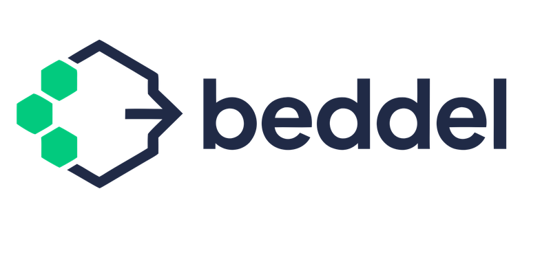

<p align="center">
  
</p>

<p align="center">
  Agent-Native Workflow Engine — Solution Kits
</p>

---

## Unified Kit and Spec Central

This repository is the **single source of truth** for kits and the cross-SDK
specification consumed by the two Beddel SDKs:

- [`beddel-py`](https://github.com/botanarede/beddel-py) — Python SDK
- [`beddel-ts`](https://github.com/botanarede/beddel-ts) — TypeScript SDK

Every kit under [`kits/`](./kits/) declares **both** `targets.python` and
`targets.typescript` in its `kit.yaml` manifest. Each language target carries
a `status` (`implemented`, `planned`, or `unavailable`) so the catalog is
self-describing — there is no implicit "unknown" state.

| Reference                                                                     | Purpose                                                              |
| ----------------------------------------------------------------------------- | -------------------------------------------------------------------- |
| [`spec/PROTOCOL.md`](./spec/PROTOCOL.md)                                      | Kit protocol version, schema extensions, capabilities matrix.        |
| [`CONTRIBUTING.md`](./CONTRIBUTING.md)                                        | How to add kits, parity rules, lifecycle states, remote-agent roadmap. |
| [`spec/kits/kit-manifest.schema.json`](./spec/kits/kit-manifest.schema.json) | Authoritative manifest schema (JSON Schema 2020-12).                 |
| [`.github/workflows/validate-kits.yml`](./.github/workflows/validate-kits.yml) | CI gate — runs on every PR (schema + parity).                       |

Current protocol version: `2026-05-09`. See [`spec/PROTOCOL.md`](./spec/PROTOCOL.md)
for compatibility table.

---

<p align="center">
  <a href="https://pypi.org/project/beddel/"></a>
  <a href="https://www.python.org/downloads/"></a>
  <a href="https://opensource.org/licenses/MIT"></a>
</p>

---

Beddel is a Python SDK for declarative AI workflow execution. Define workflows in YAML, compose them from atomic primitives (`llm`, `chat`, `guardrail`, `tool`, `call-agent`, `agent-exec`), and let the engine handle branching, retry, reflection loops, parallel execution, and multi-provider LLM routing — all without boilerplate code.

Solution Kits extend the slim core with isolated adapters, tools, and integrations. Install only what you need.

## Install

```bash
pip install "beddel[default]"    # batteries included: litellm + otel + fastapi + httpx
```

Or start minimal and add kits as needed:

```bash
pip install beddel                          # core only (3 deps: pydantic, pyyaml, click)
beddel kit install provider-litellm-kit     # add LLM provider support
```

Requires Python 3.11+.

## Quick Example

```yaml
# workflow.yaml
steps:
  - id: greet
    primitive: llm
    config:
      model: gemini/gemini-2.0-flash
      prompt: "Say hello and share a fun fact about $input.topic"
      temperature: 0.7
```

```bash
export GEMINI_API_KEY="your-key"
beddel run workflow.yaml -i topic=astronomy
```

## Solution Kits

Each kit is a self-contained package with its own dependencies declared in `kit.yaml`. The `install` command resolves sources and handles pip dependencies automatically.

```bash
beddel kit install <kit-name>               # from this repository
beddel kit install ./my-custom-kit/         # from a local directory
beddel kit install github:org/repo/kits/x   # from any GitHub repo
beddel kit list                             # list installed kits
```


### 🔌 Providers

| Kit | Description | Dependencies |
|-----|-------------|--------------|
| [`provider-litellm-kit`](kits/provider-litellm-kit/) | Multi-provider LLM adapter — 100+ providers via [LiteLLM](https://docs.litellm.ai/) (OpenAI, Gemini, Anthropic, Bedrock, Ollama, and more) | `litellm` |

### 🤖 Agent Adapters

| Kit | Description | Dependencies |
|-----|-------------|--------------|
| [`agent-claude-kit`](kits/agent-claude-kit/) | Claude Agent SDK subprocess-based agent adapter | `claude-agent-sdk` |
| [`agent-codex-kit`](kits/agent-codex-kit/) | Codex Docker-isolated agent adapter | — |
| [`agent-kiro-kit`](kits/agent-kiro-kit/) | Kiro CLI subprocess-based agent adapter | — |
| [`agent-openclaw-kit`](kits/agent-openclaw-kit/) | OpenClaw Gateway HTTP API agent adapter | `httpx` |

### 📡 Protocols

| Kit | Description | Dependencies |
|-----|-------------|--------------|
| [`protocol-mcp-kit`](kits/protocol-mcp-kit/) | Model Context Protocol client (stdio + SSE transports) | `mcp`, `jsonschema` |

### 🔐 Auth

| Kit | Description | Dependencies |
|-----|-------------|--------------|
| [`auth-github-kit`](kits/auth-github-kit/) | GitHub OAuth Device Flow credential management | `httpx` |

### 👁️ Observability

| Kit | Description | Dependencies |
|-----|-------------|--------------|
| [`observability-otel-kit`](kits/observability-otel-kit/) | OpenTelemetry tracing adapter — workflow, step, and primitive-level spans with token tracking | `opentelemetry-api` |
| [`observability-langfuse-kit`](kits/observability-langfuse-kit/) | [Langfuse](https://langfuse.com/) tracing adapter — token usage, latency, and cost attribution | `langfuse` |

### 🌐 Serving

| Kit | Description | Dependencies |
|-----|-------------|--------------|
| [`serve-fastapi-kit`](kits/serve-fastapi-kit/) | FastAPI handler factory + SSE streaming — expose workflows as HTTP endpoints | `fastapi`, `sse-starlette` |
| [`serve-mcp-kit`](kits/serve-mcp-kit/) | Expose YAML workflows as MCP servers — any MCP-compatible agent can discover and execute them | `mcp` |

### 🛠️ Tools

| Kit | Description | Dependencies |
|-----|-------------|--------------|
| [`tools-file-kit`](kits/tools-file-kit/) | File I/O tools (read, write) with path validation | — |
| [`tools-shell-kit`](kits/tools-shell-kit/) | Shell command execution via SafeSubprocessRunner | — |
| [`tools-http-kit`](kits/tools-http-kit/) | HTTP request tool via httpx | `httpx` |
| [`tools-gates-kit`](kits/tools-gates-kit/) | Validation gate tools (pytest, ruff, mypy) | — |

### 📦 Development

| Kit | Description | Dependencies |
|-----|-------------|--------------|
| [`software-development-kit`](kits/software-development-kit/) | Development workflow tools — validation gates and epic creation | — |

## Creating Your Own Kit

A kit is a directory with a `kit.yaml` manifest:

```yaml
name: my-custom-kit
version: "1.0.0"
description: "What this kit does"
author: "Your Name"

targets:
  python:
    module: "my_custom_kit"
    dependencies:
      - "some-package>=1.0"
```

Place your Python module under `src/` in the kit directory, then install:

```bash
beddel kit install ./my-custom-kit/
```

## Links

- [Python SDK (`beddel-py`)](https://github.com/botanarede/beddel-py) — full documentation, quickstart, architecture, examples
- [PyPI](https://pypi.org/project/beddel/)
- [Bug Tracker](https://github.com/botanarede/beddel/issues)

## Stay in the Loop

We write about agent-native patterns, workflow design, and SDK development on Substack.

[](https://beddelprotocol.substack.com/subscribe)

## License

[MIT](LICENSE)
