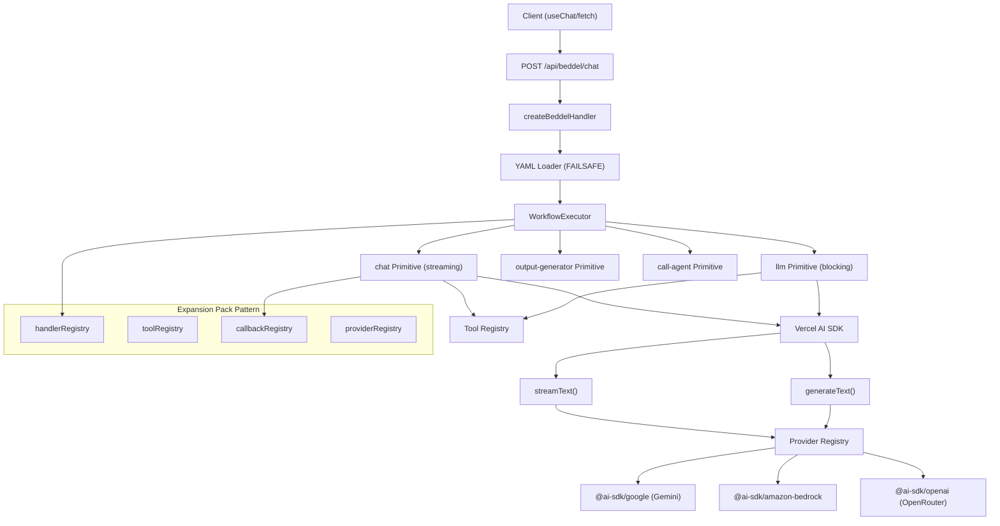

# High Level Architecture

## Technical Summary

Beddel Protocol is a **Sequential Pipeline Executor** that parses YAML workflow definitions and executes steps sequentially. The architecture prioritizes streaming-first LLM responses, secure configuration parsing, and an extensible primitive system. Core patterns include the Expansion Pack Pattern for primitive registration and the early-return pattern for streaming responses.

### Pipeline Pattern Definition

Unlike traditional "agent wrappers", Beddel is a **declarative pipeline executor**:

| Concept | Definition |
|---------|------------|
| **Workflow** | A linear list of steps defined in YAML |
| **Agent** | Just one step type (`chat` or `llm`) within the workflow |
| **Streaming** | Native `streamText` support via `chat` primitive |
| **Primitive** | A handler function for a step type (chat, llm, call-agent, output-generator) |

---

## High Level Overview

1. **Architectural Style:** Sequential Pipeline (not microservices)
2. **Repository Structure:** Monorepo package (`packages/beddel/`)
3. **Service Architecture:** Stateless executor with no external database dependencies
4. **Primary Data Flow:**
   - Client sends `{ agentId, messages }` to REST endpoint
   - `createBeddelHandler` loads YAML via `loadYaml`
   - `WorkflowExecutor` iterates over workflow steps
   - First step returning a `Response` breaks the loop and returns to client
5. **Key Decision:** REST-only API (no GraphQL) for streaming compatibility

---

## High Level Project Diagram

---

## Architectural and Design Patterns

- **Sequential Pipeline Pattern:** Workflow steps execute in order; first `Response` return breaks the loop — *Rationale:* Enables streaming without blocking subsequent steps

- **Expansion Pack Pattern:** Primitives, tools, callbacks, and providers are registered in extensible maps — *Rationale:* Inspired by BMAD-METHOD™, allows community extensions without core changes
  - `registerPrimitive(type, handler)` — Add custom step types
  - `registerTool(name, impl)` — Add custom LLM tools
  - `registerCallback(name, fn)` — Add lifecycle hooks
  - `registerProvider(name, impl)` — Add custom LLM providers

- **Early Return Pattern:** When `chatPrimitive` returns `Response`, executor immediately returns to client — *Rationale:* Prevents buffering of streaming responses

- **Semantic Primitive Separation:** `chat` for streaming frontend, `llm` for blocking workflows — *Rationale:* Clear separation of concerns, no runtime mode detection needed

- **Registry Pattern:** Primitives, tools, and callbacks use lookup maps — *Rationale:* Decouples YAML definitions from implementation details

- **Bundle Separation Pattern:** Three entry points (`beddel`, `beddel/server`, `beddel/client`) — *Rationale:* Prevents Node.js dependencies from leaking into client bundles

